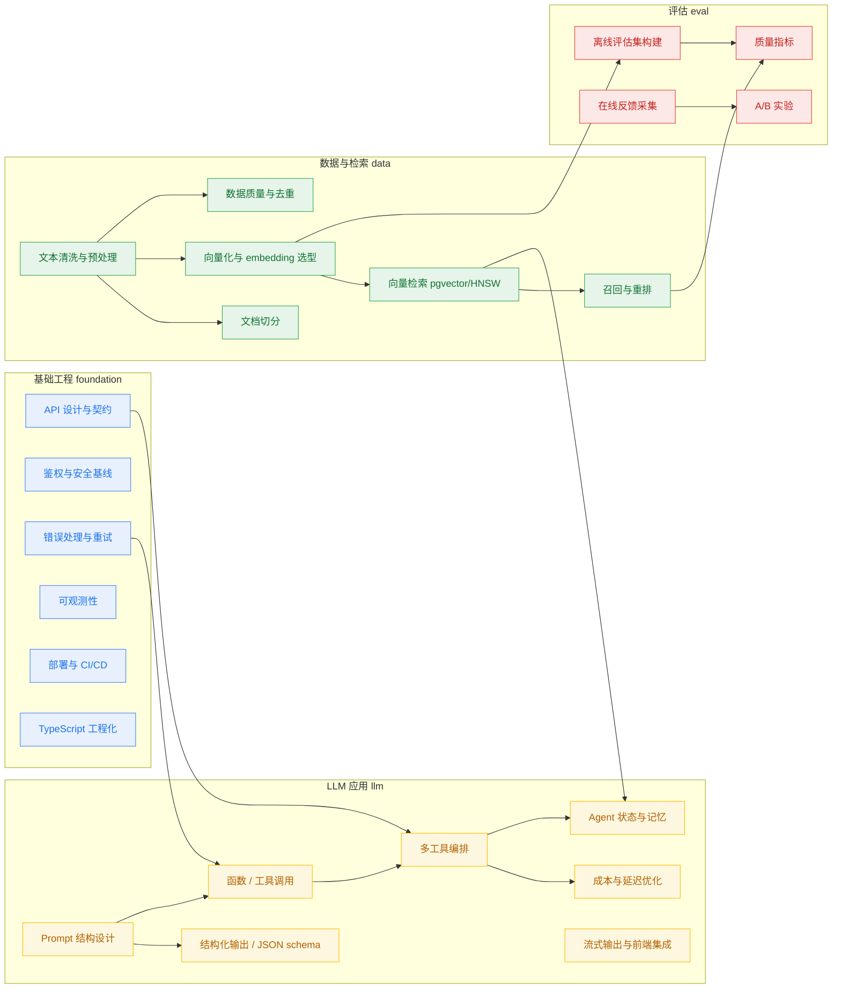

# Zeno

**别再凭感觉规划转型。** Zeno 帮你看清当前能力、找出与目标岗位的差距，并给出有真实学习资源的行动路线 —— 面向开发者与产品经理。

它不回答「该学什么」，而是回答「**为什么是你该学这个**」和「**下一步最值得学的是什么**」。

> 示例场景：前端工程师 → AI Engineer

---

## 它解决什么问题

转型时最难的不是找资料，而是判断方向：

- 我现在的能力，离目标岗位还差多少？
- 一堆该补的东西里，**先学哪个收益最大**？
- 找到的教程到底靠不靠谱、过没过时？

Zeno 把这三个问题拆成一份可执行的报告：**优势 / 差距 / 下一步**，每一步都附带经过筛选的学习资源。

---

## 能力图谱

按 foundation / data / llm / eval 四个维度组织技能，箭头表示先修依赖：



---

## 技术栈

| 层 | 选型 |
| --- | --- |
| 前端 | Next.js 15、React Flow |
| 后端 | FastAPI |
| 数据库 | Postgres 16 + pgvector |
| LLM | 可选 OpenAI，未配置时使用内置模板 |

```
zeno/
├── docker-compose.yml      # Postgres 16 + pgvector
└── apps/
    ├── api/                # 后端 API
    └── web/                # 前端 Web
```

---

## 本地启动

### 0. 起数据库（Postgres + pgvector）

```bash
docker compose up -d
```

<details>
<summary>不用 Docker：本机 Homebrew Postgres 16 + pgvector</summary>

Homebrew 的 `pgvector` formula 默认只为最新的 pg 版本编译，可能不含 pg16。可从源码针对 pg16 编译安装一次：

```bash
brew install postgresql@16
brew services start postgresql@16

# 针对 pg16 编译安装 pgvector（写入 pg16 扩展目录）
cd /tmp && git clone --depth 1 --branch v0.8.3 https://github.com/pgvector/pgvector.git
cd pgvector
make        PG_CONFIG=/opt/homebrew/opt/postgresql@16/bin/pg_config
make install PG_CONFIG=/opt/homebrew/opt/postgresql@16/bin/pg_config

# 建库 + 用超级用户启用扩展（CREATE EXTENSION 需超级用户，一次即可）
/opt/homebrew/opt/postgresql@16/bin/createdb zeno
/opt/homebrew/opt/postgresql@16/bin/psql -U "$(whoami)" -d zeno \
  -c "CREATE EXTENSION IF NOT EXISTS vector;"
```

之后把 `apps/api/.env` 的 `DATABASE_URL` 指向本机库（如 `postgresql+psycopg://<user>@localhost:5432/zeno`）即可。应用启动用的 `CREATE EXTENSION IF NOT EXISTS` 在非超级用户下仅在扩展已存在时不报错，所以这一步要用超级用户先建好。

</details>

### 1. 后端 API（FastAPI）

```bash
cd apps/api
python -m venv .venv && source .venv/bin/activate
pip install -e .                 # 或: pip install -e ".[openai]"
cp .env.example .env
alembic upgrade head             # 建表
uvicorn app.main:app --reload --port 8000
```

> 数据库 schema 的唯一事实源是 Alembic 迁移（`apps/api/migrations/`）。应用启动时不再 `create_all`，只做技能引用完整性校验（fail-fast）。新增 / 修改模型后用 `alembic revision --autogenerate -m "..."` 生成迁移，再 `alembic upgrade head`。

- 健康检查：http://localhost:8000/health
- 接口文档：http://localhost:8000/docs

### 2. 前端 Web（Next.js）

```bash
cd apps/web
cp .env.local.example .env.local
pnpm install        # 或 npm install
pnpm dev            # http://localhost:3000
```

打开 http://localhost:3000 → 点击 "Map my career" → 选择技能与熟练度（胶囊式，无需打字）→ 查看能力画像与职业图谱。

---

## 切换到 OpenAI（可选）

在 `apps/api/.env` 中：

```
LLM_PROVIDER=openai
OPENAI_API_KEY=sk-...
```

未配置时使用内置模板文案，可随时切换。
