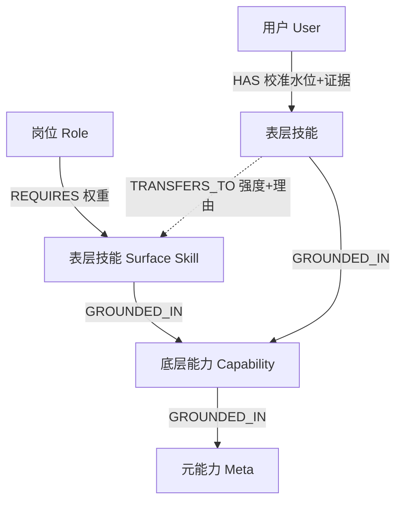

# Zeno 能力迁移图谱（Skill Graph）初版结构

> 你已有的资产：① ~2000 个前端/后端/全栈 JD；② 字节/阿里/MiniMax 的 AI 应用开发岗 JD。
> 本文把这两份数据接进一张"分层迁移图谱"，并标清楚**哪部分靠数据爬取、哪部分靠你的咨询专业**（后者才是护城河）。

---

## 一、核心洞察：迁移发生在"底层能力层"，不在"表层技能层"

如果图谱只有一层扁平技能（React、Python、RAG），系统永远只能算"你缺 RAG，去学 RAG"——这和通用大模型没区别。

真正的"能力迁移"发生在**表层技能之下的底层能力**。例：

- "后端 API 设计" 和 "AI Agent 工具编排" 表面无关，但都建立在 **接口契约设计 + 系统编排 + 异步流程控制** 之上。
- 所以一个后端工程师转 AI 开发，Agent 编排不是"从零学"，而是"底层能力已具备，只差表层封装"。

这个"穿透表层、在底层做匹配"的能力，就是 Zeno 给出"你没意识到的迁移"洞察的来源，也是你**点拨**经验的产品化形态。



---

## 二、节点类型（5 类）

### 1. 岗位节点 Role
| 字段 | 来源 |
|---|---|
| `role_id` / 名称 / 级别 / 行业语境 | — |
| `required_skills[]`（技能 + 权重） | **来自你的 JD 数据**：权重 = 出现频率 × 级别加权 |

### 2. 表层技能节点 Surface Skill（JD 字面列出的）
| 字段 | 来源 |
|---|---|
| `skill_id` / 名称 / 分类（语言/框架/工具/方法） | JD 抽取 |
| `jd_frequency` | JD 数据 |
| `time_to_acquire`（习得成本） | 你的咨询判断 + 经验值 |

### 3. 底层能力节点 Capability（护城河层）★
表层技能之下的可迁移竞争力。例：`接口契约设计`、`系统编排`、`性能调优思维`、`数据建模`、`需求拆解`、`数据闭环/评估`、`第三方集成与容错`。
> 这一层 **JD 里没有、爬不到**，需要你用咨询专业人工定义并连边。这是对手最难复制的资产。

### 4. 元能力节点 Meta
高度可迁移的通用能力：`抽象建模`、`系统思维`、`沟通表达`、`应对模糊`、`数据驱动决策`。

### 5. 证据节点 Evidence（可选但重要）
用户访谈里挖出的具体项目/决策，作为某条 `HAS` 的佐证，支撑客观校准。

---

## 三、边类型（6 类）

| 边 | 方向 | 含义 | 怎么来 |
|---|---|---|---|
| `REQUIRES` | Role → Surface | 岗位要求某技能，带权重 | **JD 频率统计** |
| `CO_OCCURS` | Surface ↔ Surface | 两技能常同时出现 | **JD 共现统计** |
| `GROUNDED_IN` | Surface → Capability | 技能建立在哪些底层能力上 | **你的人工标注（护城河）** |
| `TRANSFERS_TO` | Surface A → Surface B | 直接迁移边，带强度+理由 | 多由共享 Capability 推导 |
| `PREREQ_OF` | Skill → Skill | 学习依赖（先 A 后 B） | 你的判断，用于排路径 |
| `HAS` | User → Surface | 用户掌握，带校准水位+证据 | 访谈抽取 |

---

## 四、迁移强度计算

```
transfer_strength(A → B) =
    w1 · 共享底层能力重合度(A,B)        // 主因子，来自 GROUNDED_IN
  + w2 · JD 共现度(A,B)               // 来自数据
  + w3 · 方向修正                     // 迁移常不对称（后端→AI基建 易于 设计→AI基建）
```
初版可用规则+你的经验给种子值，后续用真实用户转型结果回归校准——这就是你"越用越准"的复利。

---

## 五、引擎规则：从「画像 + 目标」生成「迁移图谱 + 缺口」

对目标岗位每一条 `REQUIRES` 技能 S，逐条判定：

| 判定 | 条件 | 输出归类 | 用于 |
|---|---|---|---|
| **已具备** | 用户直接 `HAS` S | 强项 | 自信锚点 |
| **快速迁移** ★ | 用户已有技能 `TRANSFERS_TO` S 且强度 ≥ θ_high | "底层已覆盖，只差表层封装" | **惊艳时刻** |
| **部分迁移** | 用户具备 S 底层能力的一部分 | 列出缺哪条 Capability | 轻量补齐 |
| **真缺口** | 底层能力也不具备 | 进入学习计划 | 路径规划 |

然后：
- **可迁移强项** = 用户底层能力命中的高权重目标技能 → 产出"你比想象中更接近"。
- **缺口排序** = 真缺口按 `目标权重 × 习得成本` 排序 → 学习路径优先级。
- **路径生成** = 用 `PREREQ_OF` 排顺序、`CO_OCCURS` 打包成阶段目标。

---

## 六、完整样例：后端工程师 → AI 应用开发岗

**目标 `REQUIRES`（来自你的字节/阿里/MiniMax JD）**：
RAG、Prompt 工程、LLM API 集成、向量数据库、Agent 编排、Python、模型评估/迭代

**用户 `HAS`（访谈抽取）**：
API 设计、微服务、数据库、Python、性能优化、分布式系统调试

**逐条判定：**

| 目标技能 | 底层能力 GROUNDED_IN | 用户是否具备 | 归类 |
|---|---|---|---|
| Python | — | 直接有 | 已具备 |
| Agent 编排 | 接口契约设计 · 系统编排 · 异步流程控制 | 来自 API/微服务 | **快速迁移** |
| 向量数据库 | 数据建模 · 存储选型 · 查询优化 | 来自数据库经验 | **快速迁移** |
| LLM API 集成 | 第三方集成 · 容错 · 限流重试 | 来自后端经验 | **快速迁移** |
| Prompt 工程 | 精确表达 · 迭代调试 · 评估设计 | 调试有，评估/表达待验证 | 部分迁移 |
| RAG 系统 | 检索概念 · 数据管道 · 评估 | 管道有，检索/embedding 缺 | 真缺口（小） |
| 模型评估/迭代 | 实验设计 · 指标体系 | 缺 | 真缺口 |

**引擎结论**：
> 这次转型约 **70% 是表层封装迁移**——你的后端系统能力直接覆盖 Agent 编排、向量库、API 集成。真缺口集中在 **检索/embedding 概念 + 模型评估方法论** 两块，预计 X 周可补齐。建议路径：先补 embedding/检索基础（解锁 RAG）→ 做一个 RAG demo（打包 Prompt 工程 + 评估）→ ……

这种"具体、有取舍、点破你没意识到的优势"的输出，就是通用大模型给不出的。

---

## 七、你的数据如何落进来 & 护城河边界

| 图谱组件 | 数据来源 | 可复制性 |
|---|---|---|
| Role 节点 + `REQUIRES` 权重 | 你爬的 ~2000 JD + AI 岗 JD | 可复制（别人也能爬） |
| `CO_OCCURS` 边 | JD 共现 | 可复制 |
| **Capability 层 + `GROUNDED_IN`** | **你的咨询专业人工标注** | **难复制 ★** |
| **`TRANSFERS_TO` 强度 + 校准** | **你的经验 + 真实转型结果回归** | **难复制 ★，且越用越强** |

护城河不在数据，在于 **底层能力层的定义 + 迁移强度的判断**——正是你"点拨"经验的结晶。

---

## 八、初版可落地范围（MVP）

1. 只做 **2 条迁移线**：前端 → AI 应用开发、后端 → AI 应用开发（你数据最全的方向）。
2. Capability 层先标注 **20–30 个**最高频底层能力即可覆盖大半。
3. `TRANSFERS_TO` 强度先用你手定的种子值，不做机器学习。
4. 数据结构上，初版用关系表（roles / skills / capabilities / edges 四张表）就能跑，无需上图数据库。
